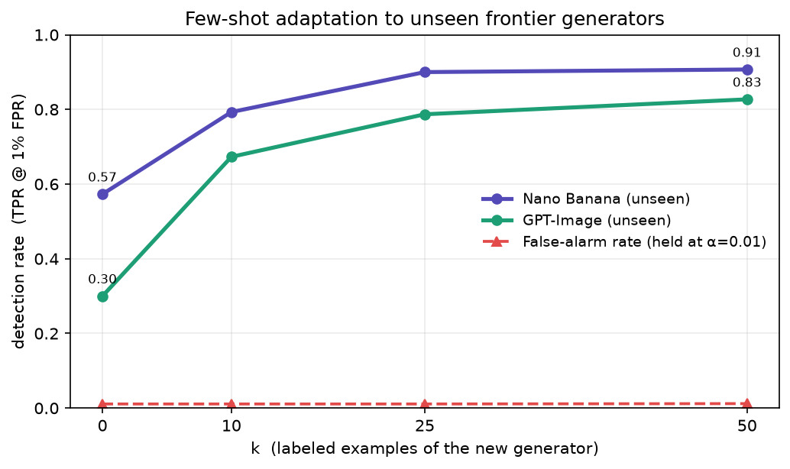

# AI-Generated Image Detector

A calibrated, explainable detector for AI-generated images — evaluated **honestly** on
the in-the-wild [Chameleon](https://shilinyan99.github.io/AIDE/) benchmark, where most
off-the-shelf detectors collapse.

**▶ Live demo:** https://huggingface.co/spaces/Xcalivier/ai-generated-detector



## What it is

A **layered** detector, not a single black-box classifier:

1. **Provenance** — checks C2PA / SynthID metadata (the reliable signal for OpenAI &
   Google outputs when intact).
2. **Forensic model** — a frozen **SigLIP** backbone (semantic features) fused with a
   **custom artifact stream** (spectral / colour / noise statistics, designed from the
   Nano Banana, GPT-Image and DALL·E technical papers).
3. **Calibrated verdict** — a Neyman-Pearson threshold with a controllable false-alarm
   rate, plus a per-stream explanation of every decision.

## Results

Held-out evaluation, 3 seeds, 95% bootstrap CIs. Images are JPEG-normalised so the
model learns *generation artifacts*, not source compression.

| Setting | AUC | Detection @ 1% FPR |
|---|---|---|
| **Chameleon** (in-the-wild, held-out) | **0.90** | — |
| **GPT-Image** (unseen generator, zero-shot) | 0.90 | 30% → **83%** with 50 labels |
| **Nano Banana** (unseen generator, zero-shot) | 0.96 | 57% → **91%** with 25 labels |

- The custom forensic stream adds **+0.05 AUC** (and +13 pts recall@5%FPR) over a
  SigLIP-only baseline — confirming the generator papers' claim that these models are
  detectable via upsampling / over-smoothing artifacts.
- The **false-alarm rate stays pinned at the target** under domain shift and few-shot
  adaptation (a finite-sample conformal threshold, recalibrated on real images alone).
- **Few-shot adaptation:** a brand-new generator is caught well after only ~25–50
  labeled examples — the realistic way to keep up as new models ship.

## Honest scope

In-the-wild AI-image detection is an **unsolved** problem; ~0.90 AUC is *competitive,
not perfect*. Robustness to an unseen generator comes from **few-shot adaptation**
(a handful of labeled examples), not zero-shot magic. The SigLIP backbone is Google's,
used frozen and credited (as everyone uses CLIP/ImageNet); the forensic stream, fusion
head, calibration, provenance layer, dataset assembly and evaluation are this project's.

## Run it

```bash
# Demo (local)
pip install -r requirements-app.txt
python app.py                      # auto-uses outputs/deploy/fusion.pt if present

# Reproduce (features cached once on a GPU, everything else trains in minutes)
pip install -e ".[extract]"
python scripts/build_manifest.py   --genimage-root ... --ffhq-dir ... --coco-dir ... --chameleon-dir ...
python scripts/01_extract_features.py --manifest feature_cache/manifest_diverse_train.csv \
       --tag diversetrain --backbones siglip forensic --normalize-jpeg
python scripts/train_deploy.py     --model fusion --backbones siglip forensic --tag diversetrain
python scripts/eval_testset.py     --model fusion --test-tag chameleontest
python scripts/09_frontier_fewshot.py --new-fake-tag gptimage --new-name GPT-Image
```

## Layout

```
pmsa/        backbones (SigLIP, forensic, CLIP, DINOv2, NPR) · features · data ·
             models (fusion + probe) · calibration · eval · provenance · inference
scripts/     build_manifest · 01 extract · train_deploy · eval_testset · 09 frontier
app.py       Gradio demo (layered detector)
tests/       calibration + metrics (run with no data/GPU)
```

## Credits

SigLIP (Google) frozen backbone; Chameleon benchmark (Yan et al., ICLR 2025);
GenImage, FFHQ, COCO and a StyleGAN2/Nano-Banana/GPT-Image evaluation set.
Pipeline, forensic stream, fusion, calibration and provenance layer by the author.
